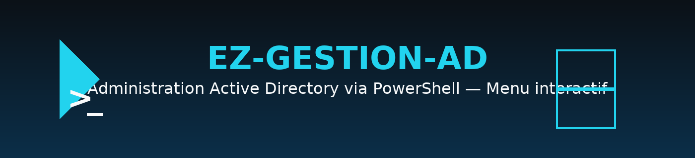
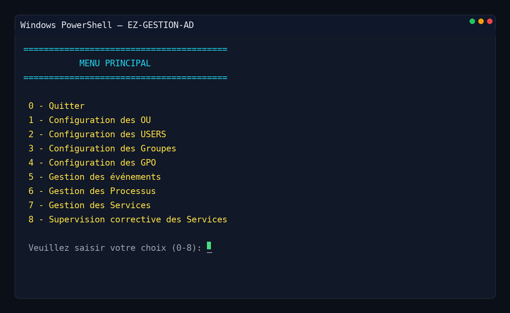

<p align="center">
  
</p>

# 🛠️ EZ-GESTION-AD

[](https://learn.microsoft.com/fr-fr/powershell/)  
[](https://learn.microsoft.com/fr-fr/windows-server/identity/ad-ds/get-started/virtual-dc/active-directory-domain-services-overview)  
[](#-licence)  
[]()  

**EZ-GESTAD.ps1** est un script PowerShell interactif permettant d’administrer un domaine **Active Directory** à travers une interface en menu texte simple et efficace.  
Il intègre à la fois des fonctions d’**administration** (OU, utilisateurs, groupes, GPO) et de **supervision** (logs, processus, services).

---

## 📌 Fonctionnalités principales

🎛️ Menu interactif avec 8 modules :
- Gestion des **OU**
- Gestion des **Utilisateurs**
- Gestion des **Groupes**
- Gestion des **GPO**
- Gestion des **Journaux d’événements**
- Gestion des **Processus**
- Gestion des **Services**
- **Supervision corrective**

---

## 📷 Aperçu visuel

### 🖼️ Capture d’écran du menu principal


---

## 📂 Modules détaillés

### 🗂️ Gestion des OU
- ➕ Créer une OU  
- ➖ Supprimer une OU (si vide)  

### 👥 Gestion des Utilisateurs
- ➕ Créer un utilisateur (login, mot de passe, OU cible)  
- 🗑️ Supprimer un utilisateur  
- 🔄 Déplacer un utilisateur vers une autre OU  
- 👤➕ Ajouter un utilisateur à un groupe  
- 🔐 Gestion des **ACL** sur un dossier partagé (`C:\Partage\Docs`)  

### 👤 Gestion des Groupes
- 📋 Lister les groupes avec type (**global / universel / sécurité / distribution**)  
- ➕ Créer un groupe  
- 🗑️ Supprimer un groupe  

### 📜 Gestion des GPO
- 📋 Lister les OU cibles  
- ⚙️ Créer et configurer des GPO prédéfinies :
  - 🚫 Bloquer le panneau de configuration  
  - 🖼️ Interdire le changement de fond d’écran  
  - ⏲️ Verrouillage automatique (10 min)  
  - 🖼️ Déploiement d’un fond d’écran spécifique  
  - 🚫 Bloquer la commande **Run** (Win+R)  
  - 🚫 Bloquer CMD  
- 🔗 Lier la GPO à une OU  

### 📊 Journaux d’événements
- 📋 Aperçu des événements **System** (3 derniers jours)  
- 🔎 Consultation d’autres journaux + export CSV  
- 👀 Surveillance en temps réel des échecs de connexion (EventID 4625) → `C:\Logs\FailedLogons.log`  

### ⚙️ Gestion des Processus
- 📊 Lister **Top 20 CPU**  
- ❌ Tuer un processus  
- ▶️ Lancer un programme  
- 📄 Voir les derniers logs  
- 🚫 Surveiller et bloquer certains processus (chrome, firefox)  
- ⏳ Blocage des applis Word/Excel le week-end  

### 🖥️ Gestion des Services
- ✅ Vérification des **services critiques AD** (DNS, NTDS, KDC, etc.)  
- 📄 Génération de rapports : **TXT / HTML / PDF**  
- ▶️ Start / ❌ Stop / 🔄 Restart d’un service  

### 🛡️ Supervision corrective
- 🔄 Relances automatiques de services/processus  
- 📄 Journalisation & rapports  

---

## 🗺️ Schéma du menu

👉 Voir le schéma généré : [EZ_GESTAD_schema.svg](./EZ_GESTAD_schema.svg)

---

## 🚀 Installation & Utilisation

1. Copier le script `EZ_GESTAD.ps1` sur votre contrôleur de domaine.  
2. Lancer PowerShell en **administrateur**.  
3. Exécuter :  
   ```powershell
   .\EZ_GESTAD.ps1
